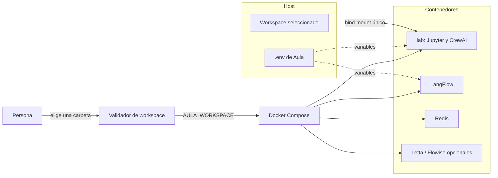
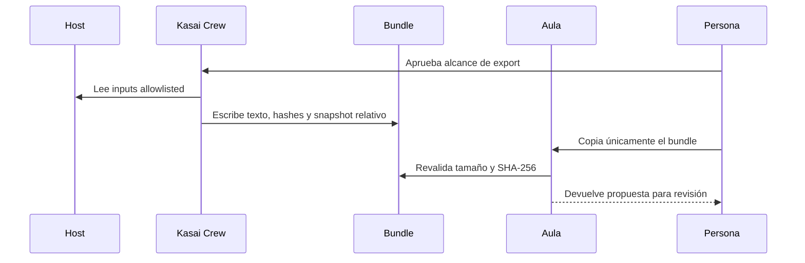

# Diagramas — Aula

## TL;DR

El servicio `lab` recibe un único workspace y secretos por entorno separado. Servicios
auxiliares usan volúmenes nombrados; no ven automáticamente el workspace.

## Montaje y servicios

La flecha del `.env` representa inyección de variables, no un montaje del archivo.

## Flujo de Kasai Crew

El repo origen no participa en la segunda mitad: montar todo `Code/` rompería la frontera.

## Estado

- implementado: variable de workspace, validador, loopback, usuario no-root y tmpfs;
- verificado estáticamente: Compose y pruebas del validador;
- pendiente: E2E de selector/permiso en macOS, Linux y Windows;
- fuera de alcance: ejecución de código realmente no confiable.

## Siguientes lecturas

- [Quickstart](../QUICKSTART.md)
- [Frontera Kasai Crew](kasai-crew-runtime.md)
- [ADR del workspace](../../governance/decisions/ADR-003-workspace-explicito.md)
